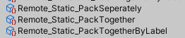

# UnityAddressablesBuilder

如果图片无法显示，可能需要使用typora查看该说明。

该框架不会对Addressables的基础知识进行说明，主要包括以下三部分功能：

①对Addressables标记资源，BuildBundle的集成处理，

②运行时的资源加载，handler处理等

③热更新的控制脚本,不包含流程说明。

## 1. 配置文件

### ①  **AddressableAssetsData/AssetGroups**  

AssetGroup配置文件目录，根据 **Local / Remote **, **Static / NonStatic **(旧版本术语，相对于新版本术语 **Can / Cannot Change Post Release**  而言更加直观) , **BundleMode (Pack Seperately / Together / Together By Label)**  这三个主要属性分为9个组


其中，Local指封入包内  **( Cannot Change Post Release,  [LocalBuildPath] + [LocalLoadPath]  )**，且不会更新的资源。


Remote指可能与远端关联，NonStatic指不封入包内**( Can  Change Post Release)**，打包时直接生成Bundle至**[RemoteBuildPath]** , 运行时直接从**[RemoteLoadPath]**下载并加载。

==注意 ：==   运行时下载的资源只在缓存里，并不会写入磁盘。如果删除了**[RemoteLoadPath]**的资源，本次运行清除handle缓存后或下次运行时，再次加载该资源会报错。


Static指封入包内 **( Cannot Change Post Release,  [LocalBuildPath] + [LocalLoadPath]  )**，但是可以通过 **Content Update**, 在 **[RemoteLoadPath]**中放入新版本资源实现**热更新(Hotfix)** 

==注意 ：==   此类Group在设置上与Local的没有差异，只是单纯地将不更新资源放入Local_Static,需要更新的资源放入 Remote_Static 中




### ②  **Utility/AssetsFrame/Setting/AddressableGroupFolderSetting**  

文件夹分组配置文件，用以记录所有可用Group,以及各个Group中不同文件夹下划分Label的策略。

**Groups数组 ** ,  引用所有自定义的Group,用于检查数据


**Settings数组** ,  存储所有需要标记的文件夹 , 分别引用需要加入的Group,以及多个文件夹配置


**FolderSetting**  :


**Title** : Editor下提示

**LabelType** :  添加Label的类型 ,  分为 **None**(无Label) , **SameAsFolder**(与引用文件夹同名) , **FolderWithPrefixAndSuffix**(文件夹加以前后缀) , **Custom**(自定义) , 并可预览最终的Label


**Folders** :  选择文件夹或直接拖入，会逐级标记子文件夹的所有资源

**SuffixFilter** : 根据后缀名进行剔除，默认不剔除，文件夹所有资源都会标记后加入Group 。例如，当不想标记预制体时，可以选择**prefab**。当进行此操作时，会对已在Group中标记的资源进行修改。例如  **FolderB/Cube_Local_Blue.prefab**已存在于Group中，当设置筛选类型为prefab时，该资源会从Group中移除


新类型可在 **AddressableGroupFolderSetting.cs**中的**SuffixType**枚举类型进行添加。

==注意 :==   枚举名必须与 explorer中资源后缀保持一致，注意大小写

==注意 :==   该操作不会进行缓存，而是按照**Settings[]**的配置顺序依次执行。如果在**Settings[1]**中进行**剔除**，但是在**Settings[2]**标记，最终该文件夹下资源会标记于Group中，反之同理。


## 2. 标记资源 ,  构建Bundle

### ① 按照上述流程设置好AddressableGroupFolderSetting

### ② Tools/Addressables 菜单下操作

**Mark Asset** : Editor下只需进行此操作，即可标记所有资源。如果Group配置中有修改，需要点击此按钮重新标记

**Reload Groups and Clear Entries** : 重新加载引用的Group,并清除**引用Group**中所有标记

**New Build** : 直接生成AssetBundle,该操作会根据之前的Bundle缓存，只生成==差量部分==，但有时会因为识别问题，无法为修改的预制体新生成Bundle（原生Bug）

**Clean Build Cache and New Build** : 清除缓存，==全量生成==AssetBundle ，耗费时间较长，但不会出现无法识别修改的问题


下图为示例的标记结果 ， 现有规则:所有资源的 ==AddressableName== 设置为 ==name + 后缀== 的形式


## 3.运行时加载

 场景 **01.LoadAssets**中，分别对Prefab 和 Sprite进行生成。

 对于预制体加载，按钮**SpawnPrefab**使用了**PrefabSpawner.cs**中的**Load()**方法，根据枚举类型，可使用不同类型的加载

#### ①  直接使用AssetReference

``` csharp
 case SpawnType.AssetReference:
      var operation=  Asset.InstantiateAsync(transform.position, Quaternion.identity,transform);
      operation.Completed += (handle) =>
      {
         gos.Add(handle.Result);
      };
         break;
```

#### ② 使用资源管理类

```csharp
  case SpawnType.AssetManager:                
      AssetsManager.Instance.CreatePrefabTask(assetName, (result, data) =>
      {
          gos.Add(result);
      },defaultParent:transform);
          break;
```

对于非预制体Asset资源(Texture，AnimationClip,Sprite等等)，使用方法同上，但由于不进行实例化和类型问题，大致可分为加载普通Asset和加载Sprite两种方法。具体可参考**AssetsManager.cs**中， **CreateAssetTask(string assetName, OnAssetLoaded callback, object userData)**  和  **CreateSpriteTask(string assetName, OnSpriteLoaded callback, object userData=null)**  方法

#### ③ AssetReference的Bug踩坑 

​		对于使用AssetReference加载非预制体Asset资源(Texture,Sprite,AnimationClip等等)时，如果进行多次调用，==会由于Addressable内部的Handle状态问题而报错==   (Unity 2021.3.2 ,  Addressables  1.19.19 , 在 2020.3.2中也遭遇过同样报错)，所以需要记录Handle状态，如果Handle已存在并持有资源，直接调用资源即可,该功能已实现

在场景中，按钮**LoadSprite** 使用了 **SpriteLoader.cs**中的**Load()** 方法 。 在使用**AssetsManager**加载时，分别可使用 **string  name** 和 **AssetReference  reference**进行加载。

```csharp
 case SpawnType.AssetsManager:
     if (LoadByReferrence)
     {
        //使用AssetReference加载
        AssetsManager.Instance.CreateSpriteTask(Asset, (handle) =>
        {
            Img.sprite = handle.Result;
        });
        }
        else
        {
             //使用name加载
             AssetsManager.Instance.CreateSpriteTask(assetName, (result, data) =>
             {
                Img.sprite = result;
             });
        }
        break;
 case SpawnType.AssetReference:
      //重复加载会报错!!
      var operation=  Asset.LoadAssetAsync<Sprite>();
      operation.Completed += (handle) =>
      {
         Img.sprite = handle.Result;
      };
      break;
```

#### ④ 使用AssetsManager

需要在程序初始化时(具体时间点依逻辑流程而定)，执行 **AssetsManager.Instance.InitAssetManager(Action onInitFinish)**

初始化完毕后，即可进行正常的加载。

### 4. 热更新

基础流程不再赘述，使用者可自行查阅。

**AddressablesHotfixManager.cs** 中，**StartHotfix(Action onHotfixComplete)** 方法已实现 比对Catalog版本，检测下载数据大小，清除本地缓存和下载新资源等功能。一般而言，该方法需要在 **AssetsManager.Instance.InitAssetManager(Action onInitFinish)** 之前调用


### 5. 迁移使用

如果要运用在使用者的项目中，只需将 ==Assets/Utility== 目录进行迁移即可，但需要保证项目目录下加载到Addressable的基础配置(==Assets/AddressableAssetsData/AddressableAssetSettings.asset==)。 如要改变目录，可在**AddressableBuilder.cs** 中修改路径

